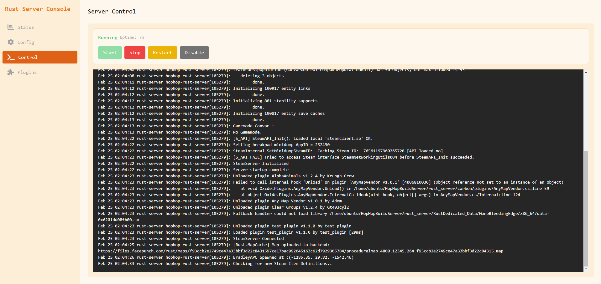

# HopHop-Build-Server
Bootstrap and rust server management tool, allows you to quickly deploy and manage your Rust game server with a web interface.
Quickly restart, update, and install plugins from the local web interface.

## Features
- Automatically update and install Carbon for any branch of Rust.
- Restart, stop, and start the server
- Install, remove, and modify plugins for the server
- View the server console
- View the server status
- Configure the server's launch parameters (including branch)
- Run RCON commands



## Usage

For a quick install run the following command:
```
curl -sSL https://raw.githubusercontent.com/nerif-tafu/HopHopBuildServer/main/install.sh | bash
```

Navigate to `http://<server-ip>:5000` to access the web interface.

Please note this assumes you are running a debian based system with Systemd installed. The install script takes some broad assumptions about your server so please read the script before running it.

If you want to just install the Systemd service and run the web server another way you can do so with the following commands:

```
curl -sSL https://raw.githubusercontent.com/nerif-tafu/HopHopBuildServer/main/install.sh
hophop-web-server
```

You can also run the install script with the `--service-only` flag to just install the Systemd service for the Rust server.

## Requirements
- 30GB of free disk space
- 12GB of RAM
- 4 CPU Cores
- A normal-ish kernel (Weird unames freaks out the rust server)

## Tech stack
- Flask
- React
- TailwindCSS
- SocketIO

## Setting up a development environment

```
python3 -m venv venv
source venv/bin/activate
pip install -e .

# Run the web server
hophop-web-server

# Run the rust server
hophop-rust-server
```